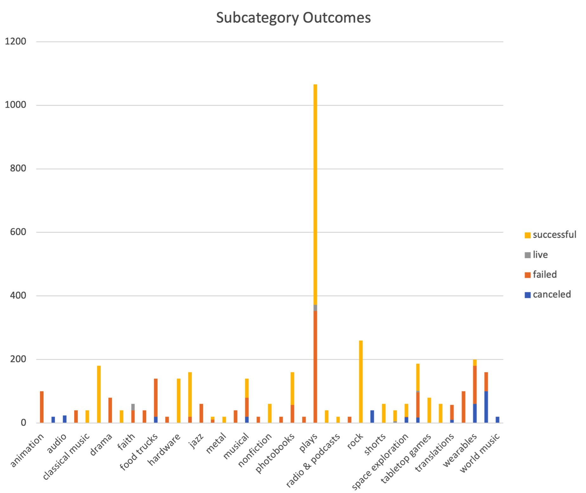
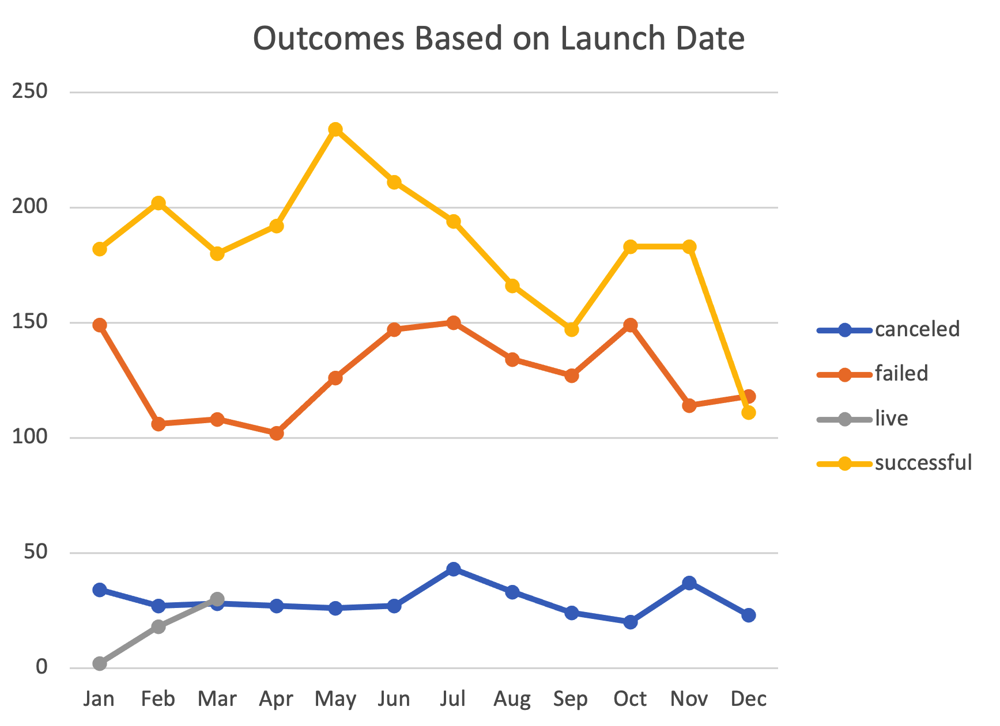

# An Analysis of Kickstarter Campaigns
Performing analysis on Kickstarter data to uncover trends 

## Image upload
* 
* 
* 

## Comments for Louise

1. For parent categories - Music and Theater have the most successful campaigns (USA and overall). They also have the most total campaigns. 
2. For subcategories - Plays have the most successful campaigns (USA and overall). They also have the most total campaigns.
3. More successful Kickstarter campaigns were launched in May than any other month. 
4. Comparing successful and failed US Kickstarter plays, we see failed campaigns have a higher mean and median goal. 
    * Perhaps a higher goal is part of the reason they fail. 
    * However, the lower mean and median pledged for failed campaigns suggests that a higher goal is not the only reason for failure. 
    * The above comment holds true unless one believes a higher goal deterred would-be backers from considering to donate. 
5. The box and whisker plot on musicals in Great Britain reaffirms that the goal often exceeds the pledged by a large amount. 
    * Mean goal = $4000. 
    * This value is an outlier for pledged. It is outside the following: Upper Quartile + 1.5 times the IQR. 

## Recommendations for Louise

1. Start in May. If you have to choose otherwise, you should start in March or April before you start in June and July, as the difference between successful and failed is larger in the months preceding May than the months following May. 
2. Start small. For a potential musical campaign in Great Britain, you should lower your goal. As described in comments 4 and 5, goals are often too high. This most likely impacts underachieving results for pledged donations. 

